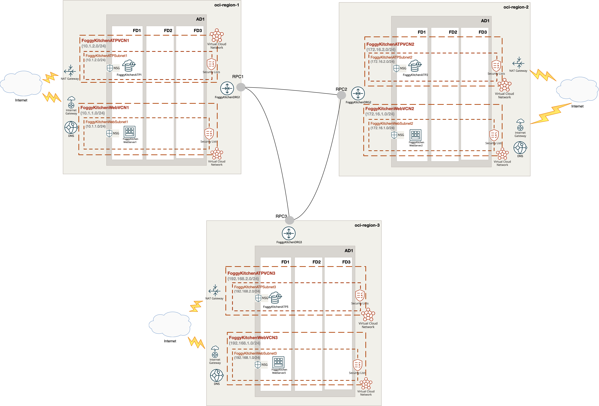

# OCI multi-region deployment 

## Project description

In this repository, I have documented my hands on experience with Terrafrom for the purpose of multi-region deployment in OCI. It includes also OCI Public DNS Setup and DNS Traffic Steering Policy. This set of HCL based Terraform files which can customized according to any requirements.  

## Topology Diagram 

With the usage of this example HCL code you can build topology documented by diagram below. This topology is extremly simplified for education purposes and rather cannot be used for production implementations. 



## How to use code 

### Deploy Using Oracle Resource Manager

1. Click [](https://cloud.oracle.com/resourcemanager/stacks/create?region=home&zipUrl=https://github.com/mlinxfeld/terraform-oci-multiregion/releases/latest/download/terraform-oci-multiregion-stack-latest.zip)

    If you aren't already signed in, when prompted, enter the tenancy and user credentials.

2. Review and accept the terms and conditions.

3. Select the region where you want to deploy the stack.

4. Follow the on-screen prompts and instructions to create the stack.

5. After creating the stack, click **Terraform Actions**, and select **Plan**.

6. Wait for the job to be completed, and review the plan.

    To make any changes, return to the Stack Details page, click **Edit Stack**, and make the required changes. Then, run the **Plan** action again.

7. If no further changes are necessary, return to the Stack Details page, click **Terraform Actions**, and select **Apply**. 

### Deploy Using the Terraform CLI

#### STEP 1.

Clone the repo from GitHub.com by executing the command as follows and then go to terraform-oci-private-oke directory:

```
[opc@terraform-server ~]$ git clone https://github.com/mlinxfeld/terraform-oci-multiregion.git
Cloning into 'terraform-oci-multiregion'...
remote: Enumerating objects: 10, done.
remote: Counting objects: 100% (10/10), done.
remote: Compressing objects: 100% (10/10), done.
remote: Total 10 (delta 0), reused 10 (delta 0), pack-reused 0
Unpacking objects: 100% (10/10), done.

[opc@terraform-server ~]$ cd terraform-oci-multiregion/

[opc@terraform-server terraform-oci-multiregion]$ ls -latr

total 2168
-rw-r--r--   1 opc opc      78 Oct 20 10:34 tls.tf
-rw-r--r--   1 opc opc    3096 Oct 20 12:39 iam_policies.tf
-rw-r--r--   1 opc opc    1933 Oct 20 12:43 datasources.tf
-rw-r--r--   1 opc opc     290 Oct 20 12:55 compartment.tf
-rw-r--r--   1 opc opc    5359 Oct 20 12:58 drgs_rpcs.tf
-rw-r--r--   1 opc opc   13099 Oct 20 17:34 nsg.tf
-rw-r--r--   1 opc opc   24337 Oct 20 18:10 network.tf
-rw-r--r--@  1 opc opc  719599 Oct 21 10:45 terraform-oci-multiregion.png
-rwxr-xr-x   1 opc opc    3340 Oct 21 14:27 compute.tf
drwxr-xr-x  95 opc opc    3040 Oct 21 14:32 ..
-rw-r--r--   1 opc opc    1222 Oct 22 12:48 providers.tf
drwxr-xr-x   6 opc opc     192 Oct 22 12:50 templates
-rw-r--r--   1 opc opc    4015 Oct 22 13:01 atp.tf
-rw-r--r--   1 opc opc   14356 Oct 22 13:43 remote.tf
-rw-r--r--   1 opc opc    1508 Oct 24 11:51 outputs.tf
-rw-r--r--   1 opc opc    3779 Oct 24 11:55 variables.tf
-rw-r--r--   1 opc opc    3988 Oct 24 12:03 dns.tf
-rw-r--r--   1 opc opc   14383 Oct 24 12:56 schema.yaml
drwxr-xr-x  31 opc opc     992 Oct 24 13:02 .
-rw-r--r--@  1 opc opc   17738 Oct 24 13:03 README.md
```

#### STEP 2.

Within web browser go to URL: https://www.terraform.io/downloads.html. Find your platform and download the latest version of your terraform runtime. Add directory of terraform binary into PATH and check terraform version:

```
[opc@terraform-server terraform-oci-multiregion]$ export PATH=$PATH:/home/opc/terraform

[opc@terraform-server terraform-oci-multiregion]$ terraform --version

Terraform v1.0.0

Your version of Terraform is out of date! The latest version
is 1.2.2. You can update by downloading from https://www.terraform.io/downloads.html
```

#### STEP 3. 
Next create environment file with TF_VARs:

```
[opc@terraform-server terraform-oci-multiregion]$ vi setup_oci_tf_vars.sh
export TF_VAR_user_ocid="ocid1.user.oc1..aaaaaaaaob4qbf2(...)uunizjie4his4vgh3jx5jxa"
export TF_VAR_tenancy_ocid="ocid1.tenancy.oc1..aaaaaaaas(...)krj2s3gdbz7d2heqzzxn7pe64ksbia"
export TF_VAR_compartment_ocid="ocid1.tenancy.oc1..aaaaaaaasbktyckn(...)ldkrj2s3gdbz7d2heqzzxn7pe64ksbia"
export TF_VAR_fingerprint="00:f9:d1:41:bb:57(...)82:47:e6:00"
export TF_VAR_private_key_path="/tmp/oci_api_key.pem"
export TF_VAR_region="eu-frankfurt-1"
export TF_VAR_region1="eu-frankfurt-1"
export TF_VAR_region2="eu-amsterdam-1"
export TF_VAR_region3="us-phoenix-1"
export TF_VAR_ATP_password="BEstrO0ng_#11"
export TF_VAR_domain_name="<mydomain.com>"

[opc@terraform-server terraform-oci-multiregion]$ source setup_oci_tf_vars.sh
```

#### STEP 4.
Run *terraform init* with upgrade option just to download the lastest neccesary providers:

```
[opc@terraform-server terraform-oci-multiregion]$ terraform init 

Initializing the backend...

Initializing provider plugins...
- Finding hashicorp/oci versions matching "4.48.0"...
- Finding latest version of hashicorp/tls...
- Installing hashicorp/tls v4.0.3...
- Installed hashicorp/tls v4.0.3 (signed by HashiCorp)
- Installing hashicorp/oci v4.48.0...
- Installed hashicorp/oci v4.48.0 (signed by HashiCorp)

Terraform has created a lock file .terraform.lock.hcl to record the provider
selections it made above. Include this file in your version control repository
so that Terraform can guarantee to make the same selections by default when
you run "terraform init" in the future.

Terraform has been successfully initialized!

You may now begin working with Terraform. Try running "terraform plan" to see
any changes that are required for your infrastructure. All Terraform commands
should now work.

If you ever set or change modules or backend configuration for Terraform,
rerun this command to reinitialize your working directory. If you forget, other
commands will detect it and remind you to do so if necessary.
```

#### STEP 5.
Run *terraform apply* to provision the content of this repo (type **yes** to confirm the the apply phase):

```
[opc@terraform-server terraform-oci-multiregion]$ terraform apply

data.oci_identity_availability_domains.region2-ADs: Reading...
data.oci_core_images.region2-OSImage: Reading...
data.oci_identity_region_subscriptions.home_region_subscriptions: Reading...
data.oci_identity_availability_domains.region1-ADs: Reading...
data.oci_core_images.region1-OSImage: Reading...
data.oci_identity_availability_domains.region3-ADs: Reading...
data.oci_core_images.region3-OSImage: Reading...
data.oci_identity_availability_domains.region2-ADs: Read complete after 0s [id=IdentityAvailabilityDomainsDataSource-3269541301]
data.oci_identity_availability_domains.region1-ADs: Read complete after 0s [id=IdentityAvailabilityDomainsDataSource-3269541301]
data.oci_core_images.region2-OSImage: Read complete after 0s [id=CoreImagesDataSource-3730359195]
data.oci_core_images.region1-OSImage: Read complete after 0s [id=CoreImagesDataSource-3730359195]
data.oci_identity_region_subscriptions.home_region_subscriptions: Read complete after 1s [id=IdentityRegionSubscriptionsDataSource-3269541301]
data.oci_identity_availability_domains.region3-ADs: Read complete after 1s [id=IdentityAvailabilityDomainsDataSource-3269541301]
data.oci_core_images.region3-OSImage: Read complete after 1s [id=CoreImagesDataSource-3730359195]

Terraform used the selected providers to generate the following execution plan. Resource actions are indicated with the following symbols:
  + create

Terraform will perform the following actions:

  # oci_core_dhcp_options.FoggyKitchenDhcpOptionsATPVCN1 will be created
  + resource "oci_core_dhcp_options" "FoggyKitchenDhcpOptionsATPVCN1" {
      + compartment_id   = (known after apply)

(...)

Plan: 111 to add, 0 to change, 0 to destroy.

Changes to Outputs:
  + FoggyKitchenATP1_Private_Endpoint_IP = [
      + (known after apply),
    ]
  + FoggyKitchenATP2_Private_Endpoint_IP = [
      + (known after apply),
    ]
  + FoggyKitchenATP3_Private_Endpoint_IP = [
      + (known after apply),
    ]
  + FoggyKitchenWebserver1_PrivateIP     = [
      + (known after apply),
    ]
  + FoggyKitchenWebserver1_PublicIP      = [
      + (known after apply),
    ]
  + FoggyKitchenWebserver2_PrivateIP     = [
      + (known after apply),
    ]
  + FoggyKitchenWebserver2_PublicIP      = [
      + (known after apply),
    ]
  + FoggyKitchenWebserver3_PrivateIP     = [
      + (known after apply),
    ]
  + FoggyKitchenWebserver3_PublicIP      = [
      + (known after apply),
    ]
  + generated_ssh_private_key            = (sensitive value)
  + oci_dns_nameservers                  = (known after apply)

Do you want to perform these actions?
  Terraform will perform the actions described above.
  Only 'yes' will be accepted to approve.

  Enter a value: yes

(...)

tls_private_key.public_private_key_pair: Creating...
oci_identity_group.FoggyKitchenRegion2Group: Creating...
oci_identity_compartment.FoggyKitchenCompartment: Creating...
oci_identity_group.FoggyKitchenRegion3Group: Creating...
oci_identity_group.FoggyKitchenRegion1Group: Creating...
tls_private_key.public_private_key_pair: Creation complete after 0s [id=9a62148ed8cd9805ab813f3a3a60b561ee7f907c]
oci_identity_compartment.FoggyKitchenCompartment: Provisioning with 'local-exec'...
oci_identity_compartment.FoggyKitchenCompartment (local-exec): Executing: ["/bin/sh" "-c" "sleep 120"]
oci_identity_group.FoggyKitchenRegion1Group: Creation complete after 3s [id=ocid1.group.oc1..aaaaaaaaom3qpja7fixfpbdmyxzrqriatq4rqlhd6qfoihk5u6edebnv3l5q]
oci_identity_group.FoggyKitchenRegion2Group: Creation complete after 3s [id=ocid1.group.oc1..aaaaaaaamv2gs2z2nmevvnl7hwp57uqmic5cf62ii342rmmsw6gbmrf723ua]
oci_identity_group.FoggyKitchenRegion3Group: Creation complete after 3s [id=ocid1.group.oc1..aaaaaaaa26lpf57yuse2etw3xtyyvmwyeyiyjn7l7lhgfruv27zokgaszk2q]
oci_identity_compartment.FoggyKitchenCompartment: Still creating... [10s elapsed]
oci_identity_compartment.FoggyKitchenCompartment: Still creating... [20s elapsed]
oci_identity_compartment.FoggyKitchenCompartment: Still creating... [30s elapsed]
oci_identity_compartment.FoggyKitchenCompartment: Still creating... [40s elapsed]

(...)

oci_database_autonomous_database.atp2: Still creating... [3m0s elapsed]
oci_database_autonomous_database.atp2: Still creating... [3m10s elapsed]
oci_database_autonomous_database.atp2: Still creating... [3m20s elapsed]
oci_database_autonomous_database.atp2: Still creating... [3m30s elapsed]
oci_database_autonomous_database.atp2: Still creating... [3m40s elapsed]
oci_database_autonomous_database.atp2: Still creating... [3m50s elapsed]
oci_database_autonomous_database.atp2: Still creating... [4m0s elapsed]
oci_database_autonomous_database.atp2: Still creating... [4m10s elapsed]
oci_database_autonomous_database.atp2: Still creating... [4m20s elapsed]
oci_database_autonomous_database.atp2: Still creating... [4m30s elapsed]
oci_database_autonomous_database.atp2: Still creating... [4m40s elapsed]
oci_database_autonomous_database.atp2: Still creating... [4m50s elapsed]
oci_database_autonomous_database.atp2: Creation complete after 4m57s [id=ocid1.autonomousdatabase.oc1.eu-amsterdam-1.anqw2ljrnlc5nbyafvtvx4xzbhcz2524fgzt54vkkc3vpkdglyg4hnp2tioa]

(...)
Apply complete! Resources: 111 added, 0 changed, 0 destroyed.

Outputs:

FoggyKitchenATP1_Private_Endpoint_IP = [
  "10.1.2.142",
]
FoggyKitchenATP2_Private_Endpoint_IP = [
  "172.16.2.83",
]
FoggyKitchenATP3_Private_Endpoint_IP = [
  "192.168.2.130",
]
FoggyKitchenWebserver1_PrivateIP = [
  "10.1.1.85",
]
FoggyKitchenWebserver1_PublicIP = [
  "130.61.85.128",
]
FoggyKitchenWebserver2_PrivateIP = [
  "172.16.1.95",
]
FoggyKitchenWebserver2_PublicIP = [
  "193.123.62.12",
]
FoggyKitchenWebserver3_PrivateIP = [
  "192.168.1.77",
]
FoggyKitchenWebserver3_PublicIP = [
  "158.101.19.204",
]
generated_ssh_private_key = <sensitive>
oci_dns_nameservers = tolist([
  {
    "hostname" = "ns1.p68.dns.oraclecloud.net"
  },
  {
    "hostname" = "ns2.p68.dns.oraclecloud.net"
  },
  {
    "hostname" = "ns3.p68.dns.oraclecloud.net"
  },
  {
    "hostname" = "ns4.p68.dns.oraclecloud.net"
  },
])
```

#### STEP 6.
After testing the environment you can remove the OCI OKE infra. You should just run *terraform destroy* (type **yes** for confirmation of the destroy phase):

```

[opc@terraform-server terraform-oci-multiregion]$ terraform destroy

tls_private_key.public_private_key_pair: Refreshing state... [id=1dd6cfa6e3a526c6359daf7cd50e926f0237d6d1]
data.oci_identity_availability_domains.region1-ADs: Reading...
data.oci_core_images.region1-OSImage: Reading...
data.oci_identity_region_subscriptions.home_region_subscriptions: Reading...
data.oci_identity_availability_domains.region3-ADs: Reading...
data.oci_core_images.region3-OSImage: Reading...
data.oci_identity_availability_domains.region2-ADs: Reading...
data.oci_core_images.region2-OSImage: Reading...
data.oci_identity_availability_domains.region1-ADs: Read complete after 0s [id=IdentityAvailabilityDomainsDataSource-3269541301]
data.oci_core_images.region1-OSImage: Read complete after 0s [id=CoreImagesDataSource-3730359195]
data.oci_identity_availability_domains.region2-ADs: Read complete after 0s [id=IdentityAvailabilityDomainsDataSource-3269541301]

(...)

Plan: 0 to add, 0 to change, 111 to destroy.

Changes to Outputs:
  - FoggyKitchenATP1_Private_Endpoint_IP = [
      - "10.1.2.142",
    ] -> null
  - FoggyKitchenATP2_Private_Endpoint_IP = [
      - "172.16.2.83",
    ] -> null
  - FoggyKitchenATP3_Private_Endpoint_IP = [
      - "192.168.2.130",
    ] -> null
  - FoggyKitchenWebserver1_PrivateIP     = [
      - "10.1.1.85",
    ] -> null
  - FoggyKitchenWebserver1_PublicIP      = [
      - "130.61.85.128",
    ] -> null
  - FoggyKitchenWebserver2_PrivateIP     = [
      - "172.16.1.95",
    ] -> null
  - FoggyKitchenWebserver2_PublicIP      = [
      - "193.123.62.12",
    ] -> null
  - FoggyKitchenWebserver3_PrivateIP     = [
      - "192.168.1.77",
    ] -> null
  - FoggyKitchenWebserver3_PublicIP      = [
      - "158.101.19.204",
    ] -> null
  - generated_ssh_private_key            = (sensitive value)
  - oci_dns_nameservers                  = [
      - {
          - hostname = "ns1.p68.dns.oraclecloud.net"
        },
      - {
          - hostname = "ns2.p68.dns.oraclecloud.net"
        },
      - {
          - hostname = "ns3.p68.dns.oraclecloud.net"
        },
      - {
          - hostname = "ns4.p68.dns.oraclecloud.net"
        },
    ] -> null

Do you want to perform these actions?
  Terraform will perform the actions described above.
  Only 'yes' will be accepted to approve.

  Enter a value: yes

(...)

oci_core_network_security_group_security_rule.FoggyKitchenWebSecurityEgressGroup3Rule2: Destroying... [id=77E9CA]
oci_core_drg_attachment.FoggyKitchenDRG3AttachmentATPVCN2: Destroying... [id=ocid1.drgattachment.oc1.phx.aaaaaaaaj646wwu2iqmgubio6xcyizskcnjalylgl6myq2je3hdlose6wr2q]
oci_core_drg_attachment.FoggyKitchenDRG3AttachmentWebVCN2: Destroying... [id=ocid1.drgattachment.oc1.phx.aaaaaaaasanw2uqzjw7rvsf5twm5d6mv7c3fmdfypwdu5e3356kqo36i566q]
oci_core_network_security_group_security_rule.FoggyKitchenATPSecurityIngressGroup3Rule2: Destroying... [id=F751E3]
oci_core_network_security_group_security_rule.FoggyKitchenWebSecurityIngressGroup3Rule3: Destroying... [id=90AB84]
oci_core_network_security_group_security_rule.FoggyKitchenATPSecurityIngressGroup3Rule1: Destroying... [id=C333CE]
oci_core_network_security_group_security_rule.FoggyKitchenATPSecurityIngressGroup3Rule3: Destroying... [id=7A32CF]
oci_core_security_list.FoggyKitchenWebSecurityList3: Destroying... [id=ocid1.securitylist.oc1.phx.aaaaaaaa33mjdjideimdvd6rab5wcagviaxzfgyoit34aqfypxgfwm6kvp4q]
oci_core_network_security_group_security_rule.FoggyKitchenATPSecurityEgressGroup3Rule2: Destroying... [id=A3B0E5]
oci_core_network_security_group_security_rule.FoggyKitchenATPSecurityEgressGroup3Rule3: Destroying... [id=BB1C39]
oci_core_network_security_group_security_rule.FoggyKitchenATPSecurityIngressGroup3Rule1: Destruction complete after 1s
oci_core_network_security_group_security_rule.FoggyKitchenWebSecurityIngressGroup3Rule3: Destruction complete after 1s
oci_core_network_security_group_security_rule.FoggyKitchenATPSecurityEgressGroup3Rule1: Destroying... [id=A58F9E]

(...)

25xcyo7g4p5unyq]
oci_core_network_security_group.FoggyKitchenATPSecurityGroup2: Destroying... [id=ocid1.networksecuritygroup.oc1.eu-amsterdam-1.aaaaaaaatekpo4nccyravjti362kiabgrpgqkc6egpf5calzsnhalavwrukq]
oci_core_network_security_group.FoggyKitchenATPSecurityGroup1: Destruction complete after 2s
oci_core_virtual_network.FoggyKitchenATPVCN1: Destroying... [id=ocid1.vcn.oc1.eu-frankfurt-1.amaaaaaanlc5nbyamsbgda7jzwgiw2z62xhpeg43easvkz2fvklrwu4ftg2a]
oci_core_network_security_group.FoggyKitchenATPSecurityGroup2: Destruction complete after 2s
oci_core_virtual_network.FoggyKitchenATPVCN2: Destroying... [id=ocid1.vcn.oc1.eu-amsterdam-1.amaaaaaanlc5nbya7xdy2ni3kwqx7wtnpfaiudqh2otcio3hvdsldrj6rgoq]
oci_core_virtual_network.FoggyKitchenATPVCN1: Destruction complete after 1s
oci_core_virtual_network.FoggyKitchenATPVCN2: Destruction complete after 0s
oci_core_network_security_group.FoggyKitchenATPSecurityGroup3: Destruction complete after 3s
oci_core_virtual_network.FoggyKitchenATPVCN3: Destroying... [id=ocid1.vcn.oc1.phx.amaaaaaanlc5nbyawq3tkhtrkgav2ilqyuyu6h3cahy2ekk6ymhkx2cuuijq]
oci_core_virtual_network.FoggyKitchenATPVCN3: Destruction complete after 1s
oci_identity_compartment.FoggyKitchenCompartment: Destroying... [id=ocid1.compartment.oc1..aaaaaaaayxvhhjidfxsq35muvshgxv62ac2mn6mi2yo2xqzsq53jgkuozfwq]
oci_identity_compartment.FoggyKitchenCompartment: Destruction complete after 0s

Destroy complete! Resources: 111 destroyed.
```
